## In Short
Blockstack is a new internet for decentralized apps that you access through the Blockstack Browser. With Blockstack, there is a new world of apps that let you own your data and maintain your privacy, security and freedom.

## How It Works
Blockstack uses the lower layers of the traditional internet and focuses on decentralizing the application layer. Blockstack provides key tools and infrastructure to developers enabling decentralized storage and decentralized authentication & identity. Developers build single-page applications in JavaScript then plug into user-run APIs, which eliminates centralized points of control. Users run decentralized apps through the Blockstack browser and give explicit read/write permissions to their data. Information is encrypted and stored on users’ personal devices. There are no middlemen, no passwords, and no massive data silos to breach.

Get started by installing the [Blockstack Browser](https://blockstack.org/install) (available for Mac, Windows, and Linux).

There are many Blockstack apps already in production and more being built every day with the participation of the online open source community and in partnership with VC Bounties Programs. See more on that at (blockstack.org/funding)

## Stats
* 3+ years in production
* 74,000+ domains registered
* Over 7,000 members in the developer community
* 4,000+ Slack community members
* 7,000+ Meet-Up Members, with events spanning 23 cities in 12 countries

## Blockstack is a Public Benefit Corp
Blockstack is both an open source project and a Public Benefit Corporation (PBC). Blockstack PBC, a Public Benefit Corp, upholds specific commitments to the greater public good in addition to stockholder interests. The mission of Blockstack PBC is to enable an open, decentralized internet. Blockstack PBC is committed to always keep the core Blockstack software open-source, and to support the decentralization of the Blockstack network. Blockstack PBC has historically taken the lead on Blockstack protocol development, but in the future will work with other parties to build a fully transparent and adaptable decentralized internet.

## History
Blockstack was started by Muneeb Ali and Ryan Shea in 2013. The first public launch of a registrar service (called the Onename App) was in March 2014 and the company went through Y Combinator in summer 2014. After YC, the company raised a Seed round led by Union Square Ventures. The company closed a Series A in January 2017, again led by Union Square Ventures, with investors including Lux Capital, Naval Ravikant, and Shana Fisher. Blockstack became a Public Benefit Corp in September 2017.

## Blockstack Values
Blockstack is an open-source project with core developers and contributors located around the world, from New York City to Hong Kong. We believe the community is one of our greatest assets, and the team engages with users via Slack, Github, Twitter, and the Blockstack Forum in order to build the best product possible.

Blockstack Team Values: (voted and decided collaboratively by the team)
* Humility
* Extreme Ownership
* Collaborative Mindset
* Possibilist
* Mission-driven

## Team

* 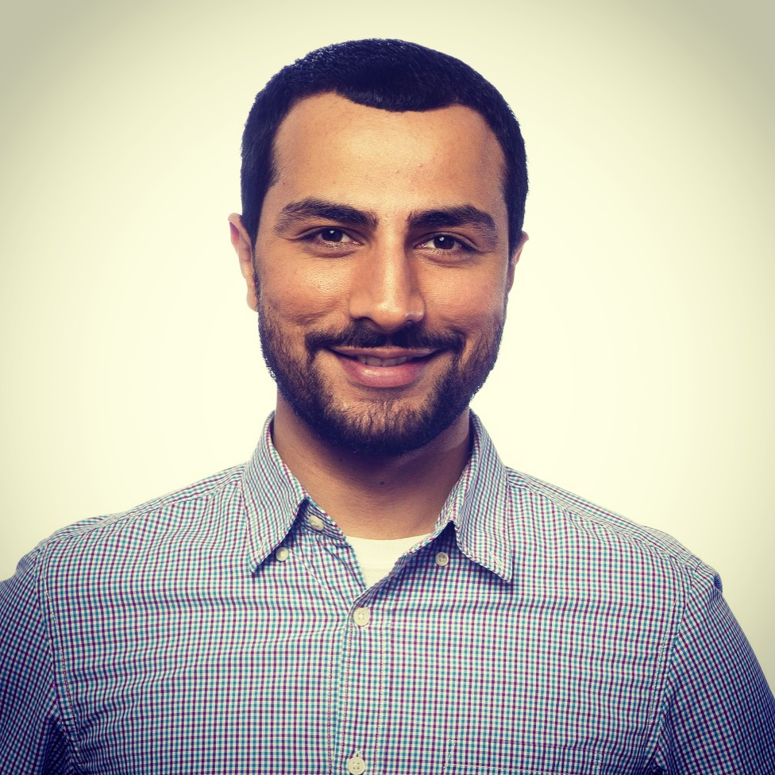
	##### Muneeb Ali
	Muneeb Ali is a distributed systems PhD from Princeton and gives guest lectures on cloud computing there. He went through Y Combinator and was awarded a J. William Fulbright Fellowship.
* 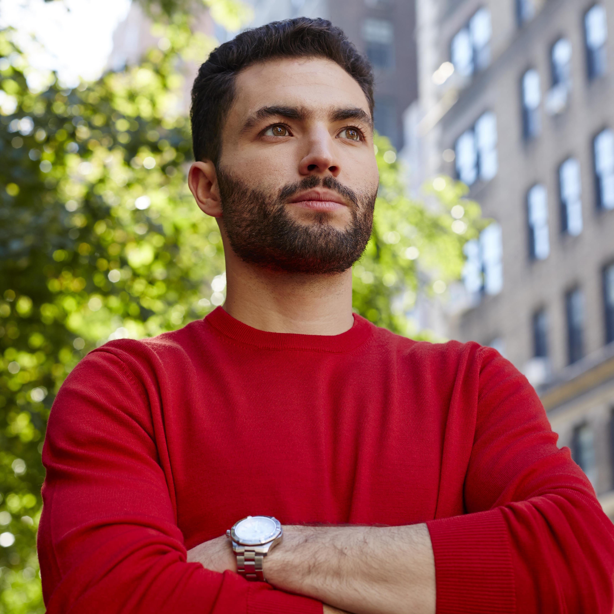
	##### Ryan Shea
	Ryan Shea studied engineering at Princeton, went through Y Combinator, and was inducted into the Forbes 30 Under 30. He has authored several popular open source libraries in cryptography and blockchains.
* 
	##### Jude Nelson
	Jude Nelson earned his PhD in computer science at Princeton and worked as a core member of PlanetLab, which received the ACM Test of Time Award for enabling planetary scale experimentation and deployment. His research covered wide-area storage systems and CDNs. 10+ years of Vim usage.
* 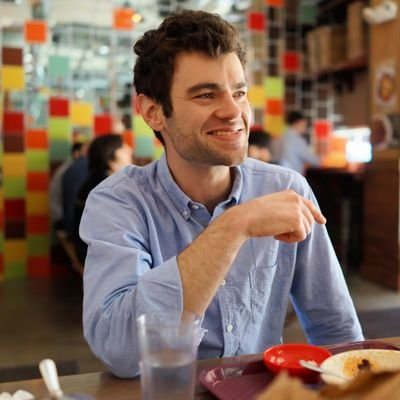
	##### Aaron Blankstein
	Aaron joined the Blockstack engineering team from an academic background, finishing his PhD in 2017. His doctoral research spanned a range of topics, mostly focusing on web application performance and security. He’s worked in information flow tracking systems, caching algorithms, compilers, and applied cryptography. 10+ years of Emacs usage.
* 
	##### Larry Salibra
	Larry Salibra co-founded Pay4Bugs, a crowdsourced security analysis and software testing platform, and is a founding member of the Bitcoin Association of Hong Kong. His work exposed private data leakage in Chinese Tinder clone Tantan, and how Apple censors apps in China.
* 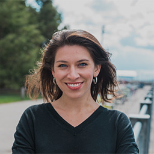
	##### Gina Abrams
	Gina Abrams studied Psychology and Social Sciences at Binghamton University. Previously she spent two years in agency technical recruiting, during which time she assisted numerous NYC start-ups in mission critical DevOps, SRE and Security hires.
* 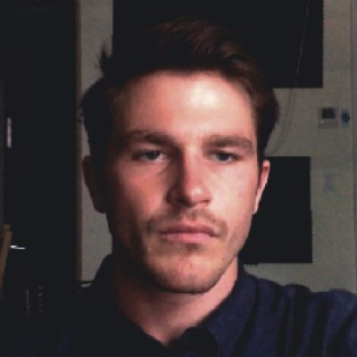
	##### Patrick Stanley
	Patrick Stanley studied Economics and Psychology at Johns Hopkins, and was the first employee at data-driven lending startup Earnest which sold to Navient for $155m in 2017. In a growth role there, he helped it scale from from 1 to 200 employees and go from $0 to $2B in originations within 3 years.
* 
	##### Ken Liao
	Ken Liao studied Computer Engineering at the University of Waterloo and co-founded the fashion brand marketplace, PR-A-PO. He designed and built mobile apps which were featured as Best New App on the Apple App Store.
* 
	##### Sebastian Dunkel
	Sebastian received his MA in Linguistics and Communications from the University of Heidelberg, Germany, and the University of Brighton, UK. Before joining the Blockstack team, he worked in localization and product support for Apple, Vimeo, and Master & Dynamic.
* 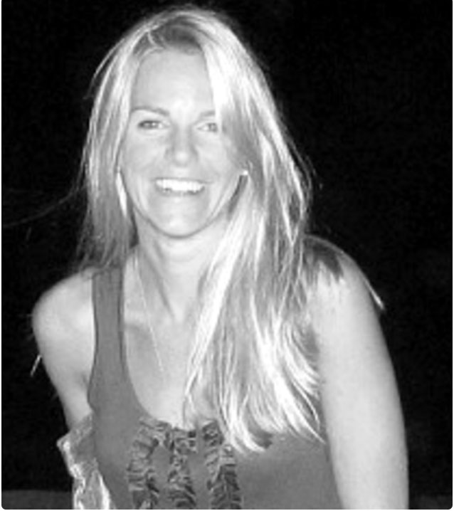
	##### Shannon Voight
	Shannon drives event and marketing programs focusing on Blockstack's growth and expansion. Prior to joining Blockstack in 2017, Shannon spent over 11 years honing her skills as event and program producer, talent manager and brand strategist at Condé Nast and Time Inc.
* 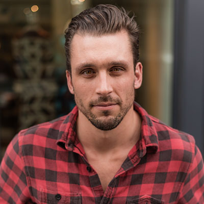
	##### Xan Ditkoff
	Xan came to Blockstack with backgrounds in private equity, investment banking, and the military. He is passionate about driving the creation, growth, and expansion of application ecosystems through his growth role and with the Signature Fund.
* 
	##### Ariella Steinhorn
	Ariella is Blockstack’s Communications Partner. She previously led communications and public policy efforts at Managed by Q. Before that, she held several communications positions at Uber, and was a speechwriter in Washington, DC.
* 
	##### Jesse Soslow
	Jesse is Blockstack’s Operations Partner. Prior to Blockstack, he led operations at Everwise, a Sequoia-backed SaaS startup, and worked as a technology transactions attorney for a large, international law firm. Jesse received his J.D. and B.A., in math, both from the University of Pennsylvania.
* 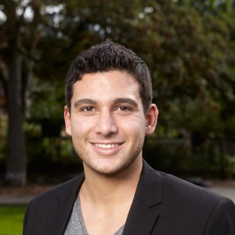
	##### Mitchell Cuevas
	Mitchell is Blockstack’s Marketing Partner. He previously led Marketing at UP Global (Startup Weekend, Startup Digest, Startup Week) before joining the Product team at Techstars. He curates the Martech Digest, advises at Cove Group, and runs ScreenChecker.
* 
	##### Jeff Domke
	Jeff leads product at Blockstack. Previously he was CPO and the first hire at CompStak (real estate analytics) where he helped grow the user base 125x, hire 50 team members, and raise 22M in funding. He also previously cofounded Signal (CX analytics) and Capsule.me (consumer messaging).
* 
	##### Hank Stoever
	Hank is an engineer at Blockstack, working on developer tools and consumer-facing products. He previously worked as an engineer for a variety of startups, including as lead developer for Startup Digest.
* 
	##### Thao-Nguyen Le
	Thao-Nguyen is People and Operations partner at Blockstack, assisting the co-founders and team with organizational prioritization, project management, team collaboration and internal communication. Prior to joining, she led operations in mission driven organizations such as Farmshelf (indoor hydro agri-tech), AntiGravity Fitness and Vietnam Heritage Center.
* 
	##### Virginia Hickox
	Virginia is a Blockstack Engineering Partner, focusing on DevOps, developing microservices and infrastructure for the decentralized web. She has a degree in Electrical Engineering from RPI, and previously worked as an Engineer in Operations for open market access for electrical power. She is interested in information privacy and democracy in the digital world.
* 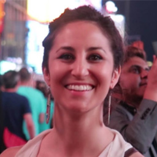
	##### Elizabeth Thys
	Liz is a Blockstack Operations Partner. Prior to Blockstack, she co-founded limeSHIFT, a creative agency that that aligns people, place and purpose, which emerged from a collaboration between MIT Sloan School of Management and MIT Department of Urban Studies and Planning. She received a BS in Mechanical Engineering from Tufts University and an MBA from MIT Sloan School of Management.
* 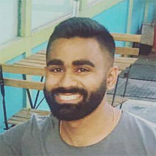
	##### Shreyas Thiagaraj
	Shreyas is a Blockstack Engineering Partner, working on developer tools and mobile efforts. He comes from a background in product development for various social apps, and before that built developer tools for mobile apps as an engineer at Microsoft. When not at work, you can find him on the hunt for the world’s best hot chocolate.
* 
	##### Mary Anthony
	Mary joined Blockstack as a Documentation Engineer. She has co-founded a CRO, managed teams, developed documentation deployment infrastructure, and designed user interfaces. Her experience includes developing content for open source, clinical research, container technologies, security software, business intelligence software, remote source control software, and system administration. She spends her non-work time studying figurative art, hiking, and trail running.
* 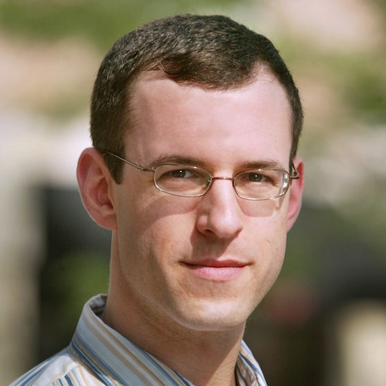
	##### Michael Freedman
	###### Technical Advisor
	Michael Freedman is a distributed systems Professor at Princeton. He was awarded the Presidential Early Career Award (PECASE), the Sloan Fellowship, and his research has led to commercial products and deployed systems reaching millions of users daily.
* 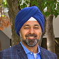
	##### JP Singh
	###### Technical Advisor
	JP Singh received his PhD from from Stanford University and is a leading authority on scalable infrastructure and applications. He is the director of the Princeton CTO Program, serves on the board of 8x8, Inc., and has been a consultant to Intel, Microsoft, and the U.S. Government.
* 
	##### Trevor Owens
	###### Technical Advisor
	Trevor Owens is an author and entrepreneur. He’s the CEO & Founder of Javelin.com, author of The Lean Enterprise: How Corporations Can Innovate Like Startups, and the creator of the global Lean Startup Machine workshop series that has trained tens of thousands of startup founders and innovators from Google, GE, News Corp, Intuit, and others, start new businesses around the world.

